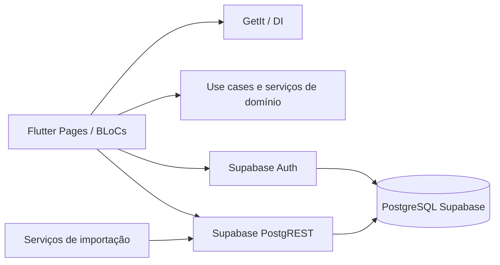

# Backend do Centelha Claudia

## 1. Objetivo

Este documento descreve o backend atualmente embutido no aplicativo Flutter e define uma arquitetura de referência para sua evolução para um backend centralizado, seguro e escalável.

O escopo inclui:

- persistência e acesso ao Supabase/PostgreSQL;
- autenticação, autorização e RLS;
- módulos de cadastro, membros, consultas, grupos, organização, ponto, calendário, presença e avaliação mensal;
- regras de negócio implementadas no código;
- importações de arquivos;
- contratos de dados e API recomendados;
- inconsistências conhecidas e plano de migração.

> Importante: o aplicativo atualmente não consome a API HTTP descrita em `documentação/API_DOCUMENTATION.md`. A integração efetiva é feita diretamente pelo cliente Flutter usando Supabase Auth e PostgREST. Os endpoints HTTP deste documento são uma proposta de backend alvo.

## 2. Estado atual em uma frase

O sistema é um aplicativo Flutter modular que inicializa o Supabase, autentica usuários pelo Supabase Auth, lê e grava diversas tabelas diretamente pelo cliente e executa parte relevante das regras de negócio localmente, principalmente o cálculo da avaliação mensal.

## 3. Arquitetura atual



### 3.1 Camadas observadas

| Camada | Responsabilidade | Situação atual |
|---|---|---|
| Apresentação | Telas, formulários, rotas e estado | Algumas telas acessam Supabase diretamente |
| Domínio | Entidades, casos de uso e cálculo de notas | Avaliação mensal está principalmente nesta camada |
| Dados | Repositórios, datasources e conversão JSON | Existe para ponto, calendário e presença |
| Infraestrutura | Supabase, DI, autenticação e SQL | Espalhada entre `lib/`, `packages/` e `scripts/` |
| Importação | CSV, JSON, Excel e lotes | Executada pelo cliente, com validação parcial |

### 3.2 Pontos de entrada relevantes

- `lib/main.dart`: inicializa o Supabase, injeta dependências e inicia o fluxo de autenticação.
- `lib/core/services/supabase_service.dart`: cliente Supabase, sessão atual e stream de autenticação.
- `lib/modules/auth/data/datasources/auth_supabase_datasource.dart`: login, logout e perfil do usuário.
- `packages/sistema_ponto/lib/src/data/repositories/presenca_repository.dart`: CRUD de presença.
- `packages/sistema_ponto/lib/src/data/repositories/calendario_repository.dart`: leitura do calendário.
- `packages/sistema_ponto/lib/src/data/datasources/ponto_datasource.dart`: CRUD de `registros_ponto`.
- `packages/sistema_ponto/lib/src/domain/usecases/calcular_avaliacao_mensal_usecase.dart`: cálculo das notas A-L e normalização.

## 4. Módulos de negócio

### 4.1 Autenticação e usuários do sistema

O login usa `Supabase Auth` com senha. Quando o usuário informa número de cadastro, o datasource procura o e-mail correspondente em `usuarios_sistema` antes de chamar `signInWithPassword`.

O perfil complementar fica em `usuarios_sistema`, incluindo:

- identificação do usuário;
- número de cadastro;
- nível de permissão;
- status ativo;
- último acesso.

A sessão deve ser a fonte de identidade. O e-mail e o número de cadastro são atributos do usuário autenticado, não devem ser usados isoladamente como prova de autorização.

### 4.2 Cadastro e membros

Existem estruturas históricas coexistentes:

- `usuarios`, definida no schema legado com muitos campos;
- `cadastro`, usada por datasources do módulo de cadastro;
- `membros`, definida em schema legado;
- `membros_historico`, usada pelo módulo atual de membros e pelo ranking.

A aplicação precisa escolher uma fonte oficial. Enquanto isso, toda integração nova deve declarar explicitamente qual tabela é a origem da verdade.

### 4.3 Consultas

O módulo de consultas grava e pesquisa atendimentos vinculados a um cadastro. Os dados podem conter informações sensíveis e devem ter acesso restrito por usuário, núcleo e nível de permissão.

### 4.4 Organização e grupos

O sistema possui entidades de organização e relacionamento:

- núcleos;
- dias de sessão;
- classificações mediúnicas;
- grupos;
- `grupo_membros`;
- grupos de tarefa;
- grupos de ação social;
- grupos de trabalho espiritual.

A associação de um membro a um grupo deve ser modelada como relacionamento com histórico, em vez de ficar apenas em texto ou em listas serializadas.

### 4.5 Calendário

O calendário operacional atual está em `calendario_2026`. O código lê atividades por data, mês e período.

Campos observados:

| Campo | Tipo atual | Significado |
|---|---|---|
| `id` | `BIGSERIAL` | Identificador da atividade |
| `data` | `TEXT` | Data no formato legado, por exemplo `26-1-1` |
| `dia_semana` | `TEXT` | Dia da semana |
| `nucleo` | `TEXT` | Núcleo ou conjunto de núcleos |
| `inicio` | `TEXT` | Horário textual |
| `atividade` | `TEXT` | Descrição da atividade |
| `vibracoes` | `TEXT` | Informações de vibração |
| `responsavel` | `TEXT` | Responsável |
| `grupos_trabalho` | `TEXT` | Grupo relacionado |
| `vibracao_numero` | `INTEGER` | Número da vibração |

A busca mensal atual carrega todas as atividades e filtra em memória. Para escala, o filtro deve ser feito no banco com colunas `date`, `timestamptz`, `tipo` e `nucleo_id` indexadas.

### 4.6 Ponto

O módulo de ponto usa `registros_ponto` para registrar eventos como entrada, saída para almoço, retorno e saída final. O caso de uso cria o registro com horário atual, tipo, localização, observação, indicador de lançamento manual e operador.

A regra de ponto aberto considera o último registro do membro. Um ponto está aberto quando o último tipo é `entrada` ou `saidaAlmoco`.

A tabela precisa ter uma migration oficial. Ela é usada pelo Dart, mas não foi encontrada nos scripts SQL principais do repositório.

### 4.7 Presenças

A tabela `registros_presenca` representa a presença de um membro em uma atividade do calendário.

Campos atuais:

- `membro_id`;
- `atividade_id`;
- `data_hora`;
- `presente`;
- `codigo`;
- `nome_registrado`;
- `justificativa`;
- `created_at` e `updated_at`.

A chave única atual é `(membro_id, atividade_id)`. A associação de importações antigas ainda pode usar `temp_<codigo>`, portanto não é uma relação confiável com `membros_historico`.

### 4.8 Avaliação mensal

A avaliação mensal é calculada em memória pelo `CalcularAvaliacaoMensalUseCase`. O resultado é uma soma de notas A-L e depois é normalizado pela maior nota real do conjunto avaliado.

Existe uma tabela `avaliacoes_mensais` planejada, mas o ranking atual não persiste nela. A avaliação deve se tornar um processo de backend versionado e auditável antes de ser usada como histórico oficial.

## 5. Persistência atual

### 5.1 Tabelas acessadas pelo código

| Tabela | Operações observadas | Principal uso |
|---|---|---|
| `usuarios_sistema` | `select`, `insert`, `update` | Login, permissões e gestão de usuários |
| `cadastro` | `select`, `insert`, `delete` | Cadastro de pessoas |
| `usuarios` | `insert` em importação | Estrutura legada de pessoas |
| `membros_historico` | `select`, `insert`, `update`, `delete` | Membros e ranking |
| `consultas` | `select`, `insert` | Histórico de consultas |
| `grupos` | `select`, `insert`, `update` | Organização |
| `grupo_membros` | `select` | Associação de membros |
| `nucleos` | `select`, `insert`, `update` | Núcleos |
| `dia_sessao` | `select`, `insert`, `update` | Dias de sessão |
| `classificacao_mediunica` | `select`, `insert`, `update` | Classificação |
| `registros_ponto` | CRUD | Ponto eletrônico |
| `calendario_2026` | `select` | Agenda de atividades |
| `registros_presenca` | CRUD e insert em lote | Presença |
| `conceitos_grupo_tarefa` | CRUD/upsert | Nota C |
| `conceitos_acao_social` | CRUD/upsert | Nota D |
| tabelas de notas configuráveis | `select`, `upsert`, `delete` | Lançamentos manuais |
| `avaliacoes_mensais` | Declarada no SQL, sem uso atual no ranking | Histórico de avaliação planejado |

### 5.2 Problemas de integridade observados

- Há nomes concorrentes para a mesma área (`usuarios`/`cadastro` e `membros`/`membros_historico`).
- Vários campos de relacionamento são `TEXT` e não possuem foreign key.
- `calendario_2026.data` é texto, dificultando filtros e ordenação temporal.
- `registros_presenca.membro_id` aceita identificador temporário.
- O script de `registros_ponto` não aparece junto dos scripts principais de criação.
- Algumas políticas permitem qualquer operação para qualquer usuário autenticado.
- Scripts de schema, RLS e documentação podem descrever versões diferentes do modelo.

## 6. Regras de negócio

### 6.1 Cálculo da avaliação mensal

Para cada membro e período:

1. selecionar o membro ativo;
2. selecionar atividades do mês;
3. selecionar presenças do período;
4. filtrar sessões mediúnicas;
5. filtrar instruções COR/Ramatis;
6. identificar escalas de cambonagem e arrumação/desarrumação;
7. calcular notas A-L;
8. somar as notas para obter `notaReal`;
9. normalizar o conjunto de avaliações;
10. ordenar por `notaFinal` para formar o ranking.

A fórmula atual é:

$$
\text{notaReal} = A+B+C+D+E+F+G+H+I+J+K+L
$$

$$
\text{notaFinal}_i = \frac{\text{notaReal}_i}{\max(\text{notaReal})} \times 100
$$

A normalização é relativa ao conjunto calculado. Portanto, adicionar ou remover membros do filtro pode alterar a nota final de todos.

### 6.2 Notas A-L

| Nota | Regra atual |
|---|---|
| A | Frequência nas sessões, considerando classificação e dia de sessão; implementação em `calculador_nota_a.dart` |
| B | Atividade do grupo de trabalho espiritual; sem atividade recebe 10, com presença recebe 10 e sem presença recebe 0 |
| C | Conceito do líder do grupo-tarefa; sem grupo ou conceito recebe 0 |
| D | Conceito de ação social; se possui grupo-tarefa recebe 10, caso contrário usa conceito do grupo de ação social |
| E | Presença em COR/Ramatis; sem instruções recebe 10, uma presença em uma instrução recebe 10, uma presença em várias recebe 5 |
| F | Presença em escala de cambonagem; sem escala recebe 10, comparecimento ou troca recebe 10 |
| G | Presença em arrumação/desarrumação; mesma lógica de F |
| H | Mensalidade em dia recebe 10; caso contrário 0 |
| I | Conceito de pai/mãe; ausência de conceito recebe 0 |
| J | Bônus do Tata; ausência de bônus recebe 0 |
| K | Membro novo ou sem nota anterior recebe 10; caso contrário usa a nota anterior |
| L | Cinco pontos por cargo de liderança |

### 6.3 Comportamentos que distorcem o ranking atual

No ranking atual:

- os mapas de conceitos de C, D, I e J são enviados vazios;
- `mensalidadeEmDia` é fixado como `true` ao converter o membro;
- grupos de tarefa e ação social são convertidos para listas vazias;
- o resultado não é salvo em `avaliacoes_mensais`;
- a importação de presença pode usar ID temporário;
- a associação de atividade por data pode sobrescrever uma atividade anterior quando existem várias no mesmo dia.

Esses defaults devem ser removidos antes de considerar o ranking como dado oficial.

### 6.4 Importação de presença

Formato esperado:

```text
ra. No.;Nome;dept.;Tempo;Máquina No.
29;0498-THAYANA;Not Set1; 01/08/2025     17:38:10;1
```

Processamento atual:

1. ler o arquivo como texto;
2. separar CSV com `;`;
3. ignorar o cabeçalho;
4. converter linhas válidas em `PresencaImportModel`;
5. registrar erros de linha e continuar;
6. agrupar por data ou por membro;
7. filtrar mês/período;
8. localizar a atividade do calendário;
9. inserir presenças em lote.

Arquitetura alvo para importação:

- criar uma tabela de staging por arquivo;
- registrar hash do arquivo e usuário responsável;
- validar todas as linhas antes da publicação;
- resolver pessoa por `codigo_ponto` com correspondência única;
- resolver atividade por data, horário e núcleo;
- rejeitar ambiguidades em vez de escolher silenciosamente;
- publicar com `upsert` idempotente;
- retornar relatório de aceitos, rejeitados e duplicados.

### 6.5 Calendário

O tipo da atividade é inferido por texto no cliente:

- `cambon` -> cambonagem;
- `arruma` -> arrumação;
- `desarruma` -> desarrumação;
- `ramatis` -> encontro Ramatis;
- `corrente` ou `oração` -> COR;
- `grupo` ou `trabalho` -> grupo de trabalho;
- `sessão` ou `sessao` -> sessão mediúnica;
- caso contrário -> outra.

Para o backend, o tipo deve ser uma coluna controlada ou uma tabela de catálogo, sem depender de palavras livres na descrição.

## 7. Autenticação e autorização

### 7.1 Fluxo atual

1. o aplicativo inicializa `SupabaseService`;
2. o usuário informa e-mail ou número de cadastro;
3. número de cadastro é convertido em e-mail por consulta a `usuarios_sistema`;
4. o Supabase Auth autentica com senha;
5. o perfil é consultado em `usuarios_sistema`;
6. o aplicativo filtra menus por `nivel_permissao`;
7. o banco aplica RLS, quando a política está configurada.

### 7.2 Níveis documentados

| Nível | Papel funcional |
|---|---|
| 1 | membro ativo, acesso básico |
| 2 | secretaria, cadastros, membros, consultas, grupos e cursos |
| 3 | pai/mãe de terreiro, sacramentos e exclusões de maior impacto |
| 4 | administrador, usuários do sistema e organização |

A autorização real deve ser aplicada no servidor. Esconder menu no Flutter é apenas uma melhoria de experiência, não um controle de segurança.

### 7.3 Riscos de segurança atuais

- `supabase_rls_public_read.sql` permite leitura pública de tabelas sensíveis.
- `registros_presenca` possui políticas amplas com `USING (true)` e `WITH CHECK (true)`.
- As tabelas de notas manuais também possuem políticas amplas para autenticados.
- Há documentação com credenciais de teste; senhas nunca devem permanecer em documentação versionada.
- Rotinas administrativas que usam service role devem ficar fora do cliente e usar variáveis de ambiente protegidas.

### 7.4 Modelo de autorização recomendado

Usar RBAC com escopo:

- `role`: papel global, por exemplo `admin`, `secretaria`, `lider`, `membro`;
- `permission`: operação específica, por exemplo `presenca.write`;
- `scope`: escopo permitido, por exemplo núcleo, grupo ou próprio registro;
- `audit`: usuário, horário, IP/origem e motivo da alteração.

As políticas devem seguir a regra de menor privilégio. Em especial, leitura de consultas, mensalidades, conceitos e dados pessoais deve ser limitada ao papel e ao escopo necessários.

## 8. API alvo recomendada

### 8.1 Princípios

- API versionada em `/api/v1`;
- autenticação via `Authorization: Bearer <token>`;
- paginação por cursor para listas grandes;
- filtros e ordenação explícitos;
- validação no servidor;
- respostas padronizadas;
- idempotência em importações e operações de cálculo;
- correlação por `requestId`;
- auditoria para operações sensíveis.

### 8.2 Endpoints principais

#### Autenticação

| Método | Rota | Objetivo |
|---|---|---|
| `POST` | `/api/v1/auth/login` | Autenticar usuário |
| `POST` | `/api/v1/auth/refresh` | Renovar sessão |
| `POST` | `/api/v1/auth/logout` | Encerrar sessão |
| `GET` | `/api/v1/auth/me` | Obter usuário e permissões |

#### Pessoas e membros

| Método | Rota | Objetivo |
|---|---|---|
| `GET` | `/api/v1/pessoas` | Pesquisar pessoas com paginação |
| `POST` | `/api/v1/pessoas` | Criar pessoa |
| `GET` | `/api/v1/pessoas/{id}` | Consultar pessoa |
| `PATCH` | `/api/v1/pessoas/{id}` | Alterar campos permitidos |
| `GET` | `/api/v1/membros` | Listar membros com filtros |
| `POST` | `/api/v1/membros` | Incluir membro |
| `GET` | `/api/v1/membros/{id}` | Consultar membro |
| `PATCH` | `/api/v1/membros/{id}` | Atualizar membro |
| `GET` | `/api/v1/membros/{id}/historico` | Consultar histórico |

#### Organização e calendário

| Método | Rota | Objetivo |
|---|---|---|
| `GET` | `/api/v1/nucleos` | Listar núcleos |
| `GET` | `/api/v1/grupos` | Listar grupos |
| `POST` | `/api/v1/grupos` | Criar grupo |
| `GET` | `/api/v1/calendario` | Consultar por período, núcleo e tipo |
| `POST` | `/api/v1/calendario` | Criar atividade |
| `PATCH` | `/api/v1/calendario/{id}` | Alterar atividade |

#### Ponto e presença

| Método | Rota | Objetivo |
|---|---|---|
| `POST` | `/api/v1/ponto/registros` | Registrar evento de ponto |
| `GET` | `/api/v1/ponto/registros` | Consultar registros |
| `GET` | `/api/v1/ponto/membros/{id}/status` | Verificar ponto aberto |
| `POST` | `/api/v1/presencas` | Registrar presença |
| `PUT` | `/api/v1/presencas/{id}` | Corrigir presença |
| `GET` | `/api/v1/presencas` | Filtrar por atividade, membro e período |
| `POST` | `/api/v1/presencas/importacoes` | Criar importação assíncrona |
| `GET` | `/api/v1/presencas/importacoes/{id}` | Ver status e erros |

#### Avaliações

| Método | Rota | Objetivo |
|---|---|---|
| `PUT` | `/api/v1/avaliacoes/{ano}/{mes}/conceitos` | Lançar conceitos manuais |
| `POST` | `/api/v1/avaliacoes/{ano}/{mes}/calcular` | Calcular e persistir avaliações |
| `GET` | `/api/v1/avaliacoes/{ano}/{mes}` | Consultar ranking |
| `GET` | `/api/v1/membros/{id}/avaliacoes` | Consultar evolução do membro |
| `POST` | `/api/v1/avaliacoes/{ano}/{mes}/revisar` | Revisar/aprovar resultado |

### 8.3 Resposta de sucesso

```json
{
  "data": {},
  "meta": {
    "requestId": "req_01H..."
  }
}
```

### 8.4 Resposta de lista

```json
{
  "data": [],
  "meta": {
    "nextCursor": "eyJpZCI6...",
    "hasMore": true,
    "requestId": "req_01H..."
  }
}
```

### 8.5 Resposta de erro

```json
{
  "error": {
    "code": "VALIDATION_ERROR",
    "message": "Existem campos inválidos.",
    "details": [
      {"field": "mes", "reason": "deve estar entre 1 e 12"}
    ],
    "requestId": "req_01H..."
  }
}
```

## 9. Modelo de dados alvo

### 9.1 Entidades canônicas

- `pessoas`: dados cadastrais e identificadores;
- `membros`: vínculo da pessoa com a organização;
- `membro_historico`: alterações de status, núcleo e classificação;
- `usuarios_sistema`: identidade e perfil de acesso;
- `nucleos`, `sessoes`, `grupos`, `grupo_membros`: organização;
- `atividades`: calendário normalizado;
- `registros_ponto`: eventos de ponto;
- `presencas`: presença em atividade;
- `conceitos`: notas manuais por competência e período;
- `escalas`: atribuições de cambonagem e arrumação;
- `mensalidades`: situação financeira do período;
- `avaliacoes_mensais`: snapshot calculado e auditável;
- `importacoes` e `importacao_itens`: processamento de arquivos;
- `auditoria_eventos`: trilha de alterações.

### 9.2 Chaves e tipos recomendados

- UUID para entidades públicas e IDs internos;
- `date` para dia civil;
- `timestamptz` para eventos com horário;
- `numeric(5,2)` para notas normalizadas;
- foreign keys reais para pessoa, membro, atividade e usuário;
- `created_at`, `updated_at`, `created_by` e `updated_by` nas tabelas mutáveis;
- `deleted_at` somente quando houver necessidade de soft delete e recuperação.

### 9.3 Índices mínimos

- `membros(status, nucleo_id)`;
- `atividades(data, nucleo_id, tipo)`;
- `presencas(atividade_id, membro_id)` com unicidade;
- `presencas(membro_id, data_hora)`;
- `avaliacoes_mensais(ano, mes, nota_final DESC)`;
- `conceitos(ano, mes, membro_id, tipo)`;
- `importacoes(status, created_at)`.

## 10. Fluxos transacionais alvo

### 10.1 Registrar presença

1. autenticar usuário;
2. validar permissão `presenca.write`;
3. validar que a atividade existe e está aberta;
4. validar que o membro está ativo;
5. executar `upsert` pela chave `(atividade_id, membro_id)`;
6. registrar origem e operador;
7. retornar o registro persistido.

### 10.2 Calcular avaliação

1. criar uma execução com `calculation_id`;
2. congelar os dados do período ou usar snapshot transacional;
3. carregar membros elegíveis, atividades, presenças e conceitos;
4. aplicar a versão da regra A-L;
5. normalizar dentro do escopo informado;
6. calcular posições e variações;
7. persistir via upsert em `avaliacoes_mensais`;
8. registrar os insumos, versão e operador;
9. permitir revisão e aprovação sem apagar o cálculo anterior.

### 10.3 Importar arquivo

1. criar registro de importação;
2. armazenar arquivo em storage privado;
3. enfileirar processamento;
4. validar e carregar staging;
5. resolver membros e atividades;
6. publicar itens válidos em transações em lote;
7. gravar rejeições com linha e motivo;
8. atualizar progresso e status;
9. disponibilizar relatório da execução.

## 11. Escalabilidade e operação

### 11.1 Separação de responsabilidades

O Flutter deve ser cliente da API. A API deve concentrar:

- autorização;
- validação;
- regras de negócio;
- transações;
- importações;
- cálculo de avaliações;
- auditoria.

O acesso direto do Flutter ao Supabase pode ser mantido temporariamente durante a migração, mas novos módulos devem usar uma camada de backend definida.

### 11.2 Processos assíncronos

Usar fila para:

- importação de arquivos;
- cálculo mensal de todos os membros;
- geração de relatórios grandes;
- notificações e tarefas de manutenção.

O endpoint deve responder com `202 Accepted` e um identificador de processo quando o trabalho não for imediato.

### 11.3 Observabilidade

Registrar:

- `requestId` e `userId`;
- duração e status da requisição;
- operação e entidade afetada;
- falhas de validação e banco;
- quantidade de itens processados;
- versão da regra de avaliação;
- métricas de latência, erro e filas.

Nunca registrar senha, token, chave service role ou dados sensíveis desnecessários nos logs.

### 11.4 Concorrência e idempotência

- usar constraints únicas no banco;
- aceitar `Idempotency-Key` em criação e importação;
- usar `upsert` apenas quando a chave de negócio estiver bem definida;
- controlar versão de registros quando houver edição concorrente;
- evitar que dois cálculos do mesmo mês publiquem resultados conflitantes.

## 12. Plano de evolução

### Fase 0: estabilização

- escolher tabelas oficiais;
- remover credenciais de documentação;
- inventariar todas as migrations;
- adicionar migration de `registros_ponto`;
- corrigir políticas públicas e políticas `USING (true)`;
- alinhar contrato de notas manuais com o código.

### Fase 1: integridade de dados

- consolidar pessoas e membros;
- trocar datas textuais por tipos nativos;
- criar foreign keys;
- substituir IDs temporários de presença;
- criar catálogo de tipos de atividade;
- adicionar constraints, índices e auditoria.

### Fase 2: domínio no servidor

- criar serviço de membros e organização;
- criar serviço de presença e importação;
- mover cálculo A-L para backend versionado;
- persistir `avaliacoes_mensais` com status `calculado`, `revisado` e `aprovado`;
- publicar API `/api/v1`.

### Fase 3: migração do aplicativo

- criar client HTTP com interceptors de autenticação;
- migrar uma funcionalidade por vez;
- manter adapters de compatibilidade durante a transição;
- comparar resultados antigo/novo do ranking;
- retirar acesso direto do Flutter às tabelas.

### Fase 4: escala operacional

- fila para importações e cálculos;
- storage privado para arquivos;
- cache apenas para leituras seguras e invalidação definida;
- backups e restauração testados;
- monitoramento e alertas;
- testes de carga nos relatórios e ranking.

## 13. Testes necessários

### Domínio

- cada calculador A-L;
- membro sem atividade;
- membro novo;
- nota anterior;
- empate no ranking;
- normalização com nota máxima zero;
- filtros por núcleo e período.

### Banco

- foreign keys;
- constraints de nota e período;
- unicidade de presença;
- transação de cálculo;
- concorrência de importação;
- triggers de `updated_at`.

### Segurança

- cada nível de permissão;
- usuário sem sessão;
- acesso a outro núcleo;
- dados próprios versus dados de terceiros;
- leitura de consultas e mensalidades;
- tentativa de alteração fora do escopo.

### Contrato

- schemas JSON de sucesso e erro;
- paginação;
- filtros;
- idempotência;
- respostas `401`, `403`, `404`, `409` e `422`.

## 14. Checklist para implementar o novo backend

- [ ] Escolher stack do servidor e estratégia de deploy.
- [ ] Definir schema canônico e migration inicial.
- [ ] Definir papéis, permissões e escopos.
- [ ] Remover credenciais e dados de teste dos documentos.
- [ ] Implementar autenticação e `/auth/me`.
- [ ] Implementar pessoas, membros e organização.
- [ ] Implementar calendário normalizado.
- [ ] Implementar ponto e presença com idempotência.
- [ ] Implementar staging e processamento assíncrono de importações.
- [ ] Implementar conceitos manuais com auditoria.
- [ ] Implementar cálculo A-L com versão da regra.
- [ ] Persistir avaliações e posições.
- [ ] Migrar o Flutter por módulo.
- [ ] Executar comparação de resultados e testes de carga.
- [ ] Desativar acesso direto às tabelas quando a migração terminar.

## 15. Referências do repositório

- [Arquitetura geral](../ARCHITECTURE.md)
- [Documentação histórica](DOCUMENTATION.md)
- [API proposta](API_DOCUMENTATION.md)
- [Autenticação](SISTEMA_AUTENTICACAO.md)
- [Importação de presenças](SISTEMA_IMPORTACAO_PRESENCAS.md)
- [Arquitetura de avaliações](ARQUITETURA_DADOS_AVALIACOES.md)
- [Schema legado](../scripts/supabase_schema.sql)
- [Políticas RLS](../scripts/supabase_rls_policies.sql)
- [Tabela de presença](../scripts/criar_tabela_registros_presenca.sql)
- [Tabela de avaliações](../scripts/criar_tabela_avaliacoes_mensais.sql)
- [Notas manuais](../scripts/criar_tabelas_notas_manuais.sql)
- [Calendário](../scripts/criar_tabela_calendario.sql)
