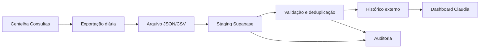

# Plano de Ação e Planejamento
## Integração Claudia ERP + Centelha Consultas

## 1. Objetivo

Criar uma integração segura e gradual entre:

- **Claudia**: ERP central, com Supabase Auth, PostgreSQL, PostgREST e RLS;
- **Centelha Consultas**: operação diária de consultas, com Firebase Auth, Realtime Database e IndexedDB offline.

A integração inicial será unidirecional:

```text
Centelha Consultas -> exportação consolidada -> staging no Supabase -> histórico no Claudia
```

O Claudia não controlará a fila operacional do Centelha Consultas no MVP.

## 2. Resultado esperado do MVP

Ao final do MVP será possível:

1. identificar pessoas e membros do Claudia por uma fonte oficial;
2. importar um dia de consultas do Firebase sem duplicidade;
3. consultar no Claudia o histórico importado;
4. preservar o payload original e os erros de importação;
5. controlar acesso por papel e núcleo;
6. reprocessar uma importação sem criar registros duplicados;
7. gerar indicadores básicos de consultas por período, núcleo e médium.

## 3. Análise do plano atual

### 3.1 Decisões corretas

- manter o Supabase como base oficial do ERP;
- manter o Firebase no módulo operacional por enquanto;
- iniciar com histórico consolidado, não com sincronização da fila;
- usar tabelas externas de importação para não contaminar o modelo principal;
- começar por importação manual antes de criar Edge Function;
- separar operação diária de relatórios gerenciais.

### 3.2 Ajustes necessários

#### Bloqueio 1: modelo de dados duplicado

O repositório contém estruturas concorrentes para avaliação e calendário:

- `membros_avaliacao` e `calendario_atividades` em `packages/sistema_ponto/database/schema.sql`;
- `membros_historico` e `calendario_2026` usadas pelo código atual;
- tabelas adicionais em `scripts/`.

**Decisão necessária:** não criar novas tabelas de integração dependentes dessas estruturas até definir o modelo canônico.

#### Bloqueio 2: identidade de pessoa e membro

A presença e o ranking podem usar identificadores temporários, e existem `cadastro`, `usuarios`, `membros` e `membros_historico` coexistindo.

**Decisão necessária:** definir uma chave canônica do membro e uma tabela de correspondência para IDs externos.

#### Bloqueio 3: segurança

Há políticas RLS amplas em tabelas sensíveis e documentos com credenciais de teste.

**Decisão necessária:** revisar RLS antes de importar histórico de consultas, feedbacks e dados pessoais.

#### Bloqueio 4: exportação ainda não comprovada

O plano define o payload esperado do Firebase, mas não há neste workspace um exportador real do App Consultas para validar o formato.

**Decisão necessária:** obter um export real ou um fixture anonimizado antes de automatizar.

#### Bloqueio 5: regra de consulta no Claudia

A tabela `consultas` existente não deve receber diretamente o payload externo sem distinguir origem, versão, importação e status de validação.

**Decisão necessária:** usar staging e histórico externo no primeiro ciclo.

## 4. Princípios de execução

- Uma fonte oficial por domínio.
- Integração unidirecional no MVP.
- Staging antes de publicação.
- Importação idempotente.
- Dados externos somente leitura inicialmente.
- Payload bruto preservado para auditoria.
- Nenhum segredo no Flutter ou em arquivos versionados.
- RLS aplicada no banco, não apenas no menu da interface.
- Automação somente após validação manual.
- Cada mudança de schema deve ser uma migration versionada.

## 5. Arquitetura do MVP



### 5.1 Componentes

| Componente | Responsabilidade | Primeira implementação |
|---|---|---|
| Exportador Consultas | produzir consultas e relatório diário | exportação manual pelo App Consultas |
| Staging | receber payload sem alterar dados oficiais | tabela `consulta_importacoes` + itens |
| Validador | validar campos, datas, origem e duplicidade | script local ou Edge Function posterior |
| Histórico externo | armazenar registros aceitos | `consulta_historico_externo` |
| Claudia | visualizar dados consolidados | tela somente leitura |
| Auditoria | registrar operador, hashes, erros e resultado | colunas de importação e log |

## 6. Plano por fases

## Fase 0 - Preparação e inventário

**Duração estimada:** 2 a 3 dias

### Ações

- congelar novas tabelas paralelas de avaliação/calendário;
- inventariar migrations e tabelas realmente existentes no Supabase;
- mapear cada tabela usada pelo Dart;
- marcar estruturas como `oficial`, `legado`, `temporária` ou `desconhecida`;
- obter export real ou fixture anonimizado do Firebase;
- retirar credenciais de teste da documentação;
- confirmar se o App Consultas possui exportação por data e núcleo.

### Entregáveis

- inventário de schema;
- mapa de dependências entre tabelas e telas;
- fixture anonimizado de um dia;
- lista de decisões pendentes;
- matriz de riscos atualizada.

### Critério de aceite

Não pode existir dúvida sobre qual tabela será usada para pessoa, membro, núcleo e histórico externo no primeiro piloto.

## Fase 1 - Identidade e modelo canônico do Claudia

**Duração estimada:** 3 a 5 dias

### Ações

- escolher tabela oficial de pessoa;
- escolher tabela oficial de membro;
- definir `member_id` canônico;
- criar identificadores externos, por exemplo `external_source` e `external_id`;
- definir regra de correspondência por cadastro, código, nome e confirmação manual;
- definir regra para pessoa não encontrada;
- documentar estados `ativo`, `inativo`, `pendente` e `não vinculado`;
- criar matriz de equivalência entre tabelas legadas.

### Modelo mínimo recomendado

```text
pessoas
membros
nucleos
external_identities
```

`external_identities` deve permitir:

```text
source = firebase_consultas
external_id = id_do_medium_ou_consulta
entity_type = member | medium | nucleus | consultation
entity_id = id_canonico
```

### Critério de aceite

Um mesmo membro pode ser localizado sem depender de nome textual e a importação consegue distinguir:

- correspondência única;
- múltiplas correspondências;
- ausência de correspondência.

## Fase 2 - Segurança e banco

**Duração estimada:** 3 a 5 dias

### Ações

- revisar RLS de cadastro, membros, consultas, mensalidades, conceitos e avaliações;
- remover leitura pública indevida;
- substituir `USING (true)` e `WITH CHECK (true)` por regras por papel e escopo;
- definir acesso por núcleo;
- garantir que service role não seja usado no cliente;
- criar migrations oficiais para tabelas necessárias;
- criar índices e constraints de importação;
- criar auditoria mínima.

### Políticas mínimas

| Papel | Pode importar | Pode ver histórico | Pode alterar histórico |
|---|---:|---:|---:|
| Administrador | sim | todos os núcleos | conforme política de correção |
| Secretaria | sim | núcleos autorizados | não no MVP |
| Líder | não | próprio núcleo | não no MVP |
| Membro | não | apenas dados permitidos | não |

### Critério de aceite

Testes com usuário sem permissão retornam `403` ou são bloqueados pelo RLS; nenhum dado sensível fica publicamente legível.

## Fase 3 - Contrato de exportação do Centelha Consultas

**Duração estimada:** 3 a 5 dias

### Ações

- definir exportação por data de referência;
- definir versão do payload;
- incluir identificadores estáveis do Firebase;
- separar consulta individual de relatório diário;
- incluir `is_test` para excluir testes dos indicadores;
- incluir `created_at` e `updated_at` de origem;
- incluir timezone e formato ISO 8601;
- calcular hash do arquivo/payload;
- gerar fixture de sucesso, duplicidade e erro.

### Payload mínimo

```json
{
  "schemaVersion": 1,
  "source": "firebase_consultas",
  "referenceDate": "2026-09-11",
  "exportedAt": "2026-09-11T23:59:59Z",
  "nucleus": {
    "externalId": "nucleo-1",
    "name": "Nucleo Central"
  },
  "consultations": [
    {
      "externalId": "firebase-consultation-1",
      "password": "A01",
      "consultantName": "Nome anonimizado",
      "medium": {
        "externalId": "medium-1",
        "name": "Medium anonimizado"
      },
      "guide": {
        "externalId": "guide-1",
        "name": "Guia anonimizado"
      },
      "phalanx": "Falange",
      "status": "completed",
      "startTime": "2026-09-11T18:00:00Z",
      "endTime": "2026-09-11T18:20:00Z",
      "rating": 5,
      "feedback": "",
      "isTest": false,
      "createdAt": "2026-09-11T17:00:00Z",
      "updatedAt": "2026-09-11T18:20:00Z"
    }
  ],
  "dailyReport": {}
}
```

### Critério de aceite

O mesmo payload pode ser enviado duas vezes e a segunda execução não duplica consultas nem relatório.

## Fase 4 - Staging e importação manual

**Duração estimada:** 4 a 6 dias

### Tabelas

Criar migrations para:

- `consulta_importacoes`;
- `consulta_importacao_itens`;
- `consulta_historico_externo`;
- `consulta_relatorios_diarios_externos`;
- `consulta_medium_stats_externos`.

### Fluxo

1. operador seleciona arquivo;
2. sistema calcula hash;
3. cria uma importação com status `recebida`;
4. grava payload bruto;
5. valida envelope e itens;
6. classifica itens como `aceito`, `rejeitado`, `duplicado` ou `pendente_vinculo`;
7. publica apenas itens aceitos;
8. gera resumo e log;
9. permite reprocessamento seguro.

### Estados da importação

```text
recebida -> validando -> pronta_para_publicar -> publicada
                              |                    |
                              v                    v
                           rejeitada           publicada_com_erros
```

### Critério de aceite

Uma importação real de um dia pode ser executada, revisada e visualizada no Claudia sem editar manualmente registros publicados.

## Fase 5 - Tela de histórico no Claudia

**Duração estimada:** 3 a 5 dias

### Ações

- criar listagem somente leitura;
- filtrar por data, núcleo, médium, status e rating;
- exibir origem e data da importação;
- exibir itens não vinculados separadamente;
- permitir acesso ao resumo da importação;
- não permitir alterar a fila ou consulta original.

### Critério de aceite

O usuário autorizado consegue verificar o histórico importado e rastrear cada registro até a importação e o ID do Firebase.

## Fase 6 - Dashboard MVP

**Duração estimada:** 3 a 5 dias

### Indicadores

- consultas concluídas por período;
- consultas por núcleo;
- consultas por médium;
- rating médio;
- quantidade de feedbacks;
- tempo total de atendimento;
- itens de teste excluídos;
- consultas não vinculadas.

### Regras

- indicadores usam apenas registros publicados;
- consultas de teste não entram nos totais;
- o período usa timezone definido pelo negócio;
- o dashboard informa a data da última importação;
- dados incompletos aparecem como pendência, não como zero silencioso.

### Critério de aceite

Os totais do dashboard batem com o relatório diário de origem para um conjunto de teste conhecido.

## Fase 7 - Automação com Edge Function

**Pré-requisito:** Fases 0 a 6 aprovadas.

### Ações

- criar `POST /functions/v1/import-consultas`;
- autenticar por usuário técnico ou segredo armazenado no Supabase;
- validar `schemaVersion`;
- validar hash e idempotência;
- executar a mesma pipeline da importação manual;
- registrar logs e métricas;
- manter uma opção de reprocessamento manual.

### Critério de aceite

A automação produz exatamente o mesmo resultado da importação manual para o mesmo payload.

## 7. Planejamento de execução

| Semana | Foco | Resultado |
|---|---|---|
| 1 | Inventário e decisões | modelo oficial e fixture definidos |
| 2 | Identidade e migrations | chaves canônicas e tabelas de integração |
| 3 | Segurança | RLS testada e credenciais removidas |
| 4 | Contrato do Firebase | payload versionado e casos de teste |
| 5 | Importação manual | staging, validação e publicação |
| 6 | Histórico Claudia | tela somente leitura e filtros |
| 7 | Dashboard | indicadores reconciliados |
| 8 | Avaliação | decisão sobre automação e próximos módulos |

A duração é uma referência de planejamento, não uma promessa de prazo. A dependência crítica é conseguir um export real ou fixture confiável do App Consultas.

## 8. Backlog priorizado

### P0 - bloqueia a integração

- [ ] Definir tabela oficial de pessoa.
- [ ] Definir tabela oficial de membro.
- [ ] Definir chave canônica e mapeamento externo.
- [ ] Obter export real/fixture do Firebase.
- [ ] Definir schemaVersion do payload.
- [ ] Criar migrations de staging.
- [ ] Corrigir RLS de dados sensíveis.
- [ ] Remover credenciais de teste da documentação.

### P1 - necessário para o piloto

- [ ] Implementar validação de payload.
- [ ] Implementar deduplicação por origem/data/ID externo.
- [ ] Implementar relatório de rejeições.
- [ ] Implementar reprocessamento idempotente.
- [ ] Exibir histórico somente leitura no Claudia.
- [ ] Reconciliar totais com relatório diário.
- [ ] Criar auditoria de importação.

### P2 - evolução após o piloto

- [ ] Criar Edge Function.
- [ ] Automatizar exportação diária.
- [ ] Criar dashboard gerencial.
- [ ] Vincular pessoas externas a membros canônicos.
- [ ] Incorporar dados agregados de médium.
- [ ] Criar notificações de falha.

### P3 - não fazer no MVP

- [ ] Migrar todo o Firebase para Supabase.
- [ ] Fazer sincronização bidirecional.
- [ ] Permitir que Claudia edite a fila operacional.
- [ ] Criar backend próprio pago.
- [ ] Misturar ranking e histórico de consultas em uma única tabela.

## 9. Matriz de responsabilidades

| Frente | Responsabilidade principal | Aprovação necessária |
|---|---|---|
| Dados Claudia | definir pessoa, membro e núcleo oficiais | responsável pelo ERP |
| Segurança | RLS, papéis, segredos e auditoria | responsável técnico |
| App Consultas | exportação, IDs externos e regras de fechamento | responsável pelo Consultas |
| Integração | staging, validação, deduplicação e publicação | responsável técnico |
| Produto | filtros, indicadores e experiência de leitura | responsável funcional |
| Qualidade | fixtures, reconciliação e testes de regressão | equipe de validação |

## 10. Riscos e mitigação

| Risco | Impacto | Mitigação |
|---|---|---|
| Nome duplicado de membro | alto | ID externo + vínculo manual pendente |
| IDs Firebase instáveis | alto | exigir ID persistente e versionar payload |
| Importação duplicada | alto | hash, chave única e idempotência |
| RLS permissiva | crítico | revisar antes do piloto e testar por papel |
| Payload incompleto | médio | staging e rejeição por campo obrigatório |
| Divergência de timezone | médio | ISO 8601 e timezone oficial documentado |
| Relatório divergente | alto | reconciliação automática e fixture conhecido |
| Mudança de schema no Firebase | alto | `schemaVersion` e compatibilidade explícita |
| Falha de exportação diária | médio | status de última importação e reprocessamento |
| Dados sensíveis em logs | crítico | mascaramento e política de retenção |

## 11. Critérios de decisão entre manual e automático

A automação somente deve ser aprovada quando:

- três importações consecutivas forem processadas sem duplicidade;
- os totais importados coincidirem com a origem;
- todos os erros forem rastreáveis por item;
- usuários sem permissão forem bloqueados;
- houver reprocessamento testado;
- o payload estiver versionado;
- existir responsável pelo monitoramento da rotina.

## 12. Definição de pronto do piloto

O piloto está pronto quando:

- [ ] uma exportação anonimizada foi validada;
- [ ] o modelo oficial do Claudia foi escolhido;
- [ ] o payload possui versão;
- [ ] as migrations foram aplicadas em ambiente de teste;
- [ ] RLS foi testada com usuários de papéis diferentes;
- [ ] a importação manual foi executada duas vezes sem duplicar;
- [ ] itens inválidos aparecem em relatório;
- [ ] o histórico é somente leitura;
- [ ] os indicadores batem com a origem;
- [ ] existe procedimento de rollback/reprocessamento;
- [ ] nenhum segredo está no cliente ou no Git.

## 13. Próxima ação recomendada

A próxima ação técnica deve ser uma reunião curta de decisão sobre **fonte oficial de pessoa/membro** e a coleta de **um export real ou fixture anonimizado de um dia**. Sem esses dois artefatos, qualquer código de integração corre o risco de consolidar IDs e regras erradas.

## Referências

- [Plano de integração original](../packages/sistema_ponto/PLANO_INTEGRACAO_CLAUDIA_CONSULTAS.md)
- [Documentação de backend](BACKEND_DOCUMENTATION.md)
- [Schema do pacote de avaliação](../packages/sistema_ponto/database/schema.sql)
- [Schema legado do Supabase](../scripts/supabase_schema.sql)
- [Políticas RLS](../scripts/supabase_rls_policies.sql)
- [Tabela atual de presença](../scripts/criar_tabela_registros_presenca.sql)
- [Tabela planejada de avaliações](../scripts/criar_tabela_avaliacoes_mensais.sql)
